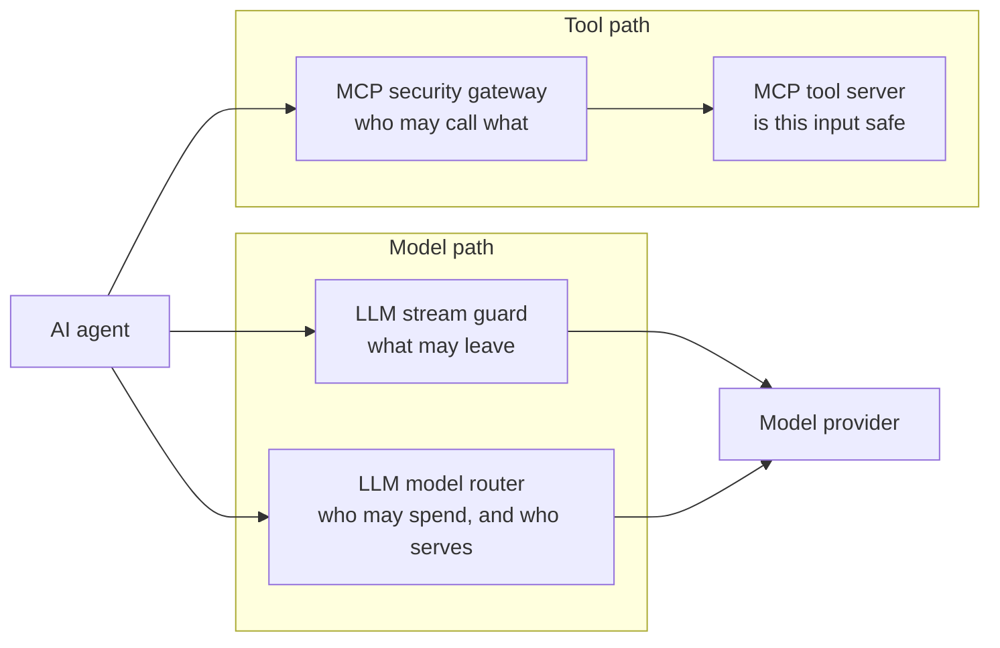
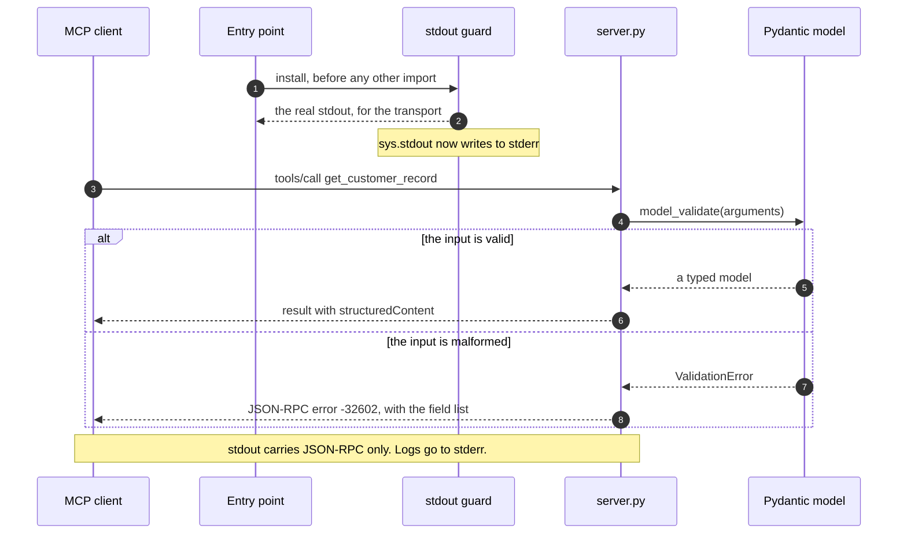
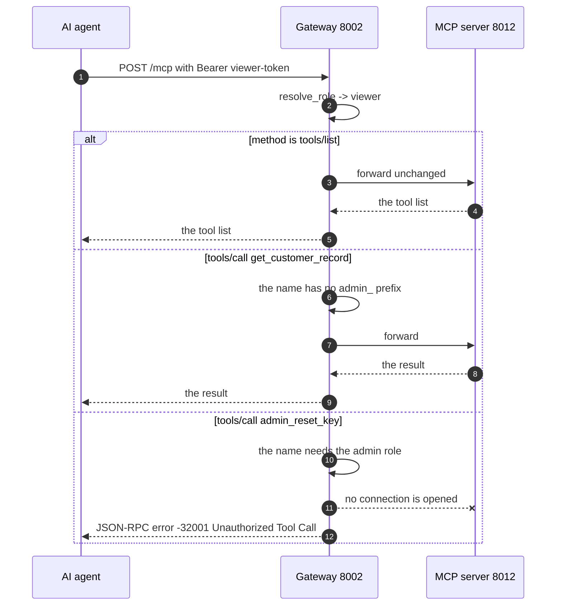
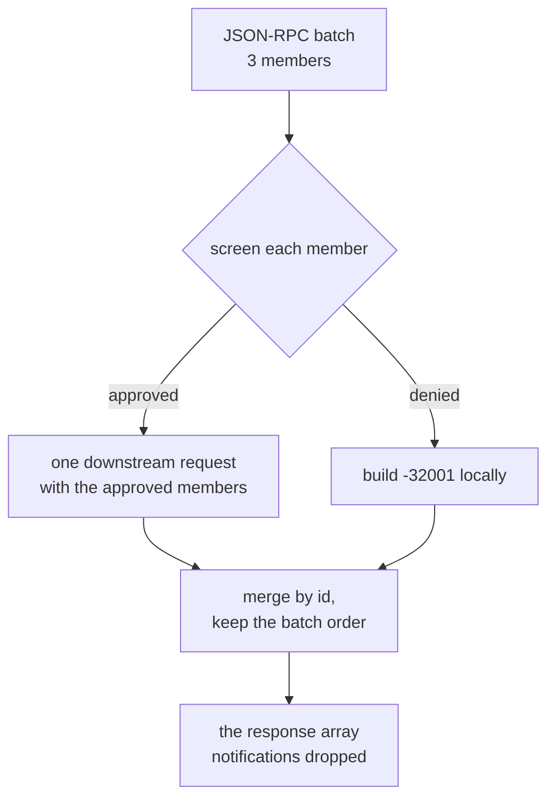
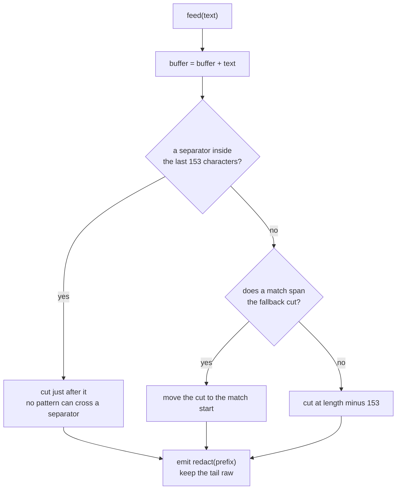
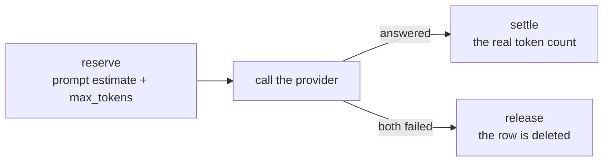
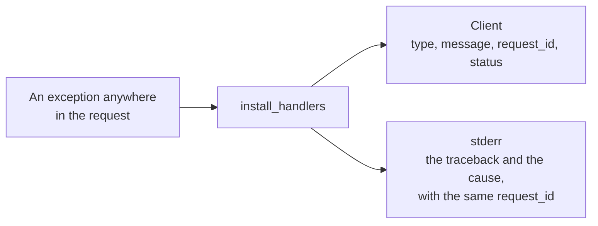

# LLM & MCP Gateways with Guardrails

Four services that sit between an AI agent and the systems it reaches. Each one
is a control point that the agent cannot skip.

| Service | Guards against | Package |
| --- | --- | --- |
| **MCP tool server** | A malformed tool input that reaches your business logic | [`gateways.mcp_tool_server`](src/gateways/mcp_tool_server/) |
| **MCP security gateway** | An agent calling an admin tool with a viewer token | [`gateways.mcp_gateway`](src/gateways/mcp_gateway/) |
| **LLM stream guard** | A model streaming an email, an SSN, or a card number to a user | [`gateways.llm_stream_guard`](src/gateways/llm_stream_guard/) |
| **LLM model router** | One tenant draining the budget, and a provider that stalls | [`gateways.llm_router`](src/gateways/llm_router/) |

MCP means Model Context Protocol. PII means personally identifiable
information. SSN means the United States social security number.

Python 3.12 or later. Every external system is mocked, so nothing needs an API
key or a network.

---

## Quick start

```bash
make install     # uv sync
make check       # ruff + 93 tests
make demo        # all 4 demonstrations, about 30 seconds
```

Run one demonstration. Each script starts what it needs and stops it at the end.

```bash
bash scripts/demo_tool_server.sh     # validation errors, and a clean stdout
bash scripts/demo_gateway.sh         # an admin tool denied to a viewer
bash scripts/demo_stream_guard.sh    # PII redacted across chunk boundaries
bash scripts/demo_router.sh          # failover on 429, on timeout, and the token budget
```

---

## The shape of the system

An agent reaches 2 kinds of external system: a tool server, and a model
provider. Each path gets its own control point.



Layout:

```
src/gateways/
  core/                logging to stderr, JSON-RPC models, the error envelope
  mcp_tool_server/     the MCP server and its stdout guard
  mcp_gateway/         the proxy, the auth, the policy, the mock downstream
  llm_stream_guard/    the redactor, the SSE codec, the proxy, the mock provider
  llm_router/          the limiter, the sqlite layer, the router, the providers
tests/                 one folder for each service, plus the shared core
scripts/               one demonstration for each service
design/                requirements, architecture, and 17 decision records
```

---

## MCP tool server

Two customer tools over the stdio transport. `get_customer_record` takes a
`customer_id` in the format `CUST-XXXXX`. `trigger_refund` takes a
`customer_id`, a positive `amount`, and a `reason` of at least 10 characters.



### A validation failure is a protocol error, not a tool result

The SDK decorator `@server.call_tool()` wraps the handler in
`except Exception` and returns a result with `isError=true`. A raised
`McpError` never reaches the wire through it. So
[server.py](src/gateways/mcp_tool_server/server.py) registers the handler
directly:

```python
server.request_handlers[types.CallToolRequest] = _handle_call_tool
```

The dispatcher then turns a raised `McpError` into a real JSON-RPC error.

| Case | Code |
| --- | --- |
| Bad format, wrong type, or an extra field | -32602 |
| Unknown tool | -32601 |
| A failure inside the tool body | -32603 |

The error `data` names the field and the reason, never the value. A value can
hold customer data.

### A stray print must not corrupt the stream

[stdout_guard.py](src/gateways/mcp_tool_server/stdout_guard.py) runs before any
other import. It hands the real stdout to the transport, then replaces
`sys.stdout`. A `print()` anywhere, in your code or in a dependency, lands on
stderr with the prefix `[stdout-leak]`.

The advertised `inputSchema` comes from `model_json_schema()`, so the schema
the client reads and the schema the server enforces can never differ.

```bash
uv run python -m gateways.mcp_tool_server     # stdio, no port
```

Design: [design/services/mcp-tool-server.md](design/services/mcp-tool-server.md)

---

## MCP security gateway

The gateway authenticates the HTTP request once. It authorizes each JSON-RPC
member separately. It forwards only the members it approved.



### Deny before you connect

The policy runs on the parsed body, inside the gateway process. The downstream
server counts its requests at `/stats`, and a test asserts that the counter
does not move on a denied call. That counter is the proof, not a comment.

### A batch is screened member by member



A notification, which carries no `id`, gets no response, as JSON-RPC 2.0
requires.

The denial returns HTTP 200, because a JSON-RPC error is a valid JSON-RPC
response. The body names the reason:

```json
{"jsonrpc": "2.0", "id": 1,
 "error": {"code": -32001, "message": "Unauthorized Tool Call",
           "data": {"tool": "admin_reset_key", "required_role": "admin"}}}
```

```bash
uv run python -m gateways.mcp_gateway --downstream   # port 8012
uv run python -m gateways.mcp_gateway                # port 8002
```

Demo tokens: `admin-token` and `viewer-token`.

Design: [design/services/mcp-gateway.md](design/services/mcp-gateway.md)

---

## LLM stream guard

The hard part is not the regular expression. The hard part is that a pattern
can split across 2 chunks. The provider sends `ada@exam`, then `ple.com`. A
redactor that works on one chunk alone misses the email. A redactor that waits
for the end of the stream destroys the time to first token.


### How the hold-back picks its cut



**The buffer is bounded.** A cut always happens, so the held tail never passes
306 characters, whatever the answer length. Memory does not grow with the
response.

**The time to first token stays low.** Normal prose holds spaces often, so the
redactor emits almost every word at once and holds one partial word. Measured
on the demonstration:

| Measure | Value |
| --- | --- |
| Provider pace | 26 chunks, 25 ms each |
| Time to first token | about 110 ms, near 2 provider chunks |
| Total stream time | about 720 ms |

**The held tail stays raw.** An early version redacted the buffer in place. A
complete but still growing match, such as `a@b.co` before the `m` arrives,
became `[REDACTED]m`. The redactor now redacts only the text that it emits.

Patterns: email, SSN, and credit card. A card candidate must also pass the Luhn
check, which cuts false positives on long digit runs. Every pattern is bounded
and nests no quantifier, so the engine cannot backtrack out of control.

```bash
uv run python -m gateways.llm_stream_guard --provider   # port 8013
uv run python -m gateways.llm_stream_guard              # port 8003
```

Design: [design/services/llm-stream-guard.md](design/services/llm-stream-guard.md)

---

## LLM model router

Two concerns in one request path: a token budget for each tenant, and a
provider that may be full or slow.


### The check and the insert are one transaction

A separate check and insert lets 2 parallel requests both pass a full window.
[limiter.py](src/gateways/llm_router/limiter.py) runs the evict, the sum, and
the insert inside one `BEGIN IMMEDIATE` transaction, which takes the write lock
at the start. A test fires 50 parallel reservations at a 1000 token window and
asserts that exactly 10 pass.

### Counting runs in 2 phases



The reservation holds the worst case while the call runs, so a burst cannot
overshoot the window. The settle step then corrects the row, so a rough
estimate never distorts the total. A failed request releases its row, so a
failure never consumes the budget.

### The client learns nothing about the upstream

Every failure passes through one envelope in
[core/errors.py](src/gateways/core/errors.py):

```json
{"error": {"type": "upstream_unavailable",
           "message": "No model provider answered the request.",
           "request_id": "9c23d505819e4a71af5884de3e4ea5aa", "status": 503}}
```



A test plants a secret string in an upstream failure and asserts that it never
reaches the response body. `asyncio.wait_for` cancels the primary on a timeout,
so no dead connection stays open while the secondary runs.

### Demonstration output

```
  healthy primary            -> 200 provider=primary
  primary returns 429        -> 200 provider=secondary
  primary stalls 5000 ms     -> 200 provider=secondary
  both providers fail        -> 503 upstream_unavailable
  burst of 10 parallel requests, 8192 tokens each, against a 50000 token window:
       7 200
       3 429
```

```bash
uv run python -m gateways.llm_router --primary     # port 8014
uv run python -m gateways.llm_router --secondary   # port 8015
uv run python -m gateways.llm_router               # port 8004
```

Demo tenant keys: `tenant-a-key` and `tenant-b-key`. The database file is
`var/router.sqlite3`, in WAL mode.

Design: [design/services/llm-router.md](design/services/llm-router.md)

---

## Shared rules

All 4 services follow the same rules.

- Logs go to stderr only. The tool server depends on it, and the rest keep it
  so a container log reads the same way for all 4.
- One `httpx.AsyncClient` for each application, opened in the FastAPI lifespan.
- One error envelope for every client-facing failure, with a `request_id` that
  also appears in the log.
- Every external system is mocked. No test needs a network or an API key.

## Configuration

Each service reads its own environment prefix. Every value has a working
default, so nothing is required.

| Variable | Default | Effect |
| --- | --- | --- |
| `GATEWAYS_LOG_LEVEL` | `INFO` | The level for every stderr logger |
| `MCP_GATEWAY_DOWNSTREAM_URL` | `http://127.0.0.1:8012/mcp` | Where the MCP gateway forwards |
| `MCP_GATEWAY_ADMIN_TOOL_PREFIX` | `admin_` | The prefix that needs the admin role |
| `MCP_GATEWAY_TOKENS_JSON` | 2 demo tokens | The token to role map |
| `STREAM_GUARD_PROVIDER_URL` | `http://127.0.0.1:8013/v1/stream` | Where the stream guard reads |
| `ROUTER_DATABASE_PATH` | `var/router.sqlite3` | The limiter database file |
| `ROUTER_TOKEN_LIMIT_PER_MINUTE` | `50000` | The window size for each tenant |
| `ROUTER_PRIMARY_TIMEOUT_SECONDS` | `3.0` | The primary budget before failover |
| `ROUTER_API_KEYS_JSON` | 2 demo keys | The API key to tenant map |

## Tests

```bash
uv run pytest -q                          # 93 tests
uv run pytest tests/llm_stream_guard -q   # one service
```

| Level | What it covers |
| --- | --- |
| Unit | The redactor, the limiter, the policy, the patterns, the error envelope |
| In-process integration | Each FastAPI application through `httpx.ASGITransport` |
| Subprocess integration | The tool server, because its stdout test needs a real process boundary |
| Live socket | The time to first token, because the in-process transport buffers the body |
| Property | The redactor, splitting the same text at every offset |
| Concurrency | 50 parallel reservations against one sqlite file |

Every test names the rule it covers:

```python
@pytest.mark.req("T3-R4")
def test_a_pattern_split_across_many_chunks_is_redacted(): ...
```

`tests/core/test_requirement_coverage.py` fails if a rule listed in
[design/requirements.md](design/requirements.md) has no test.

## Known limits

Each limit names the one function that a real deployment replaces.

- The token maps in the gateway and the router are static. Replace
  `resolve_role` and `_resolve_tenant`.
- `estimate_tokens` divides the character count by 4. Replace it with the
  provider tokenizer. The settle step already corrects the window total.
- The Luhn check reduces false positives on card numbers but does not remove them.
- The sqlite limiter covers one host. A multi-host deployment needs Redis. The
  limiter interface does not change.
- The mock providers replace real model endpoints. They speak plain HTTP JSON,
  so a real adapter replaces `Provider.complete` alone.
- The router fails over on 5xx as well as on 429 and on a timeout. That is a
  deliberate addition.

## Documents

| Document | What it answers |
| --- | --- |
| [design/requirements.md](design/requirements.md) | Every rule, with the identifier that the tests name |
| [design/architecture.md](design/architecture.md) | How the services fit together, and what they share |
| [design/decisions.md](design/decisions.md) | Why each choice is what it is. 17 records |
| [design/testing.md](design/testing.md) | How the suite proves the rules |
| [design/roadmap.md](design/roadmap.md) | What is delivered, and what comes next |
| [design/operations/zero-trust-runbook.md](design/operations/zero-trust-runbook.md) | Why a gateway breaks in a zero-trust network |

The decision records carry a `Refinement after implementation` note wherever
the code taught us something the design did not predict. Those notes are the
fastest way to understand the tricky parts.
