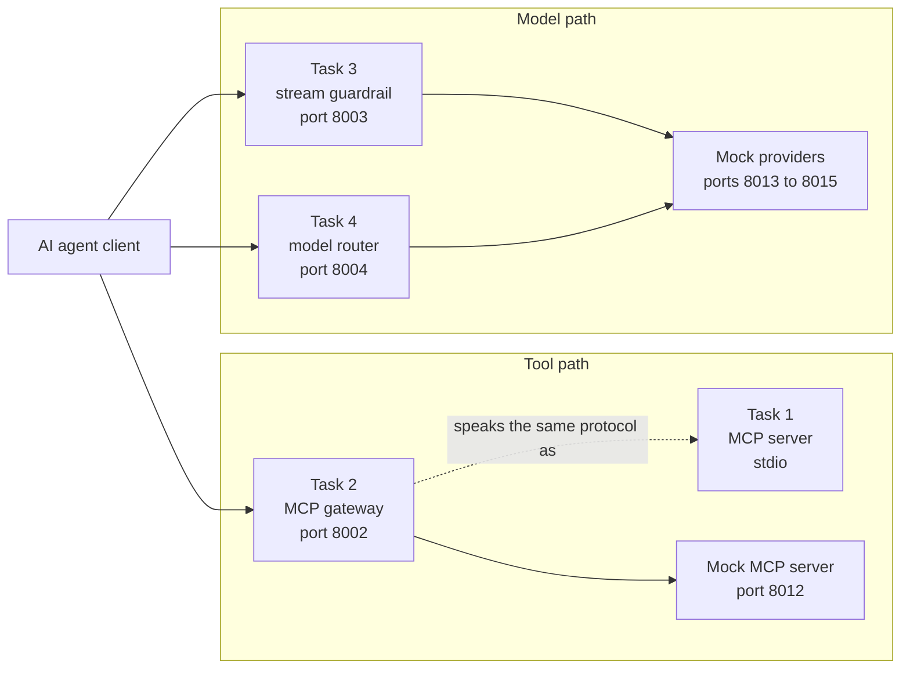
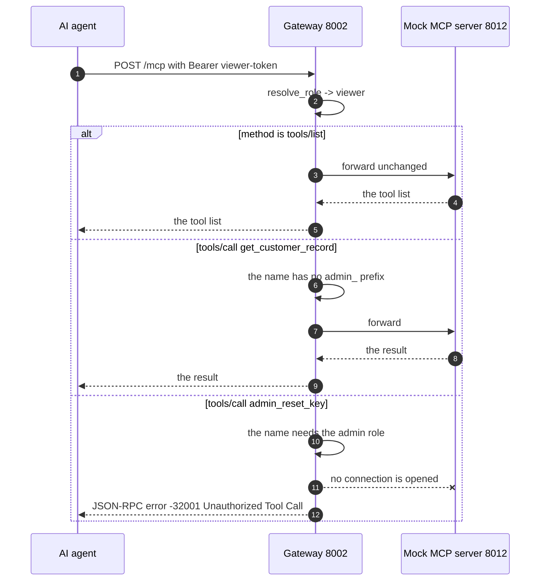
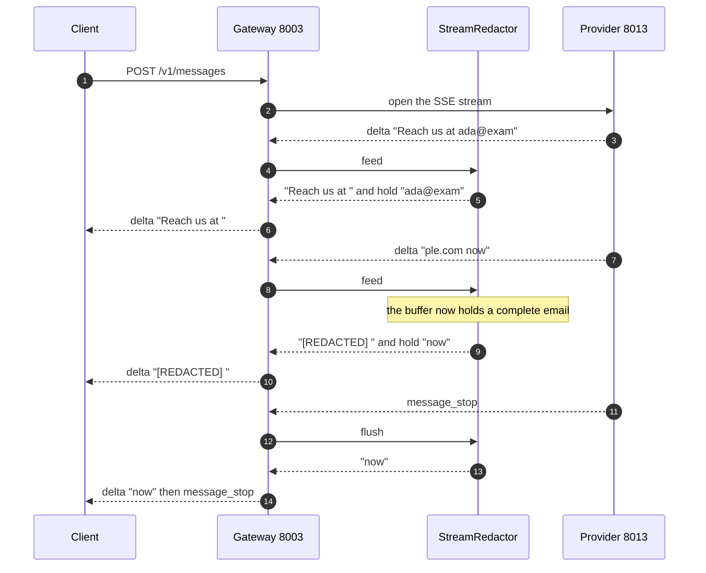
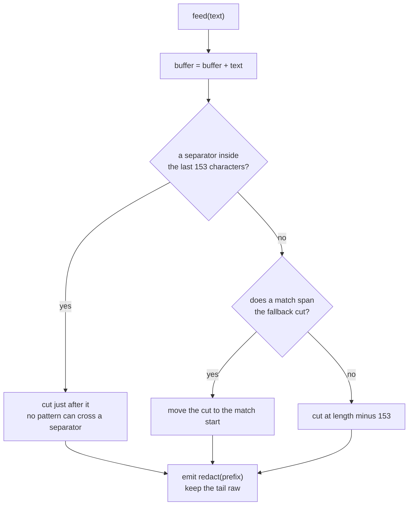
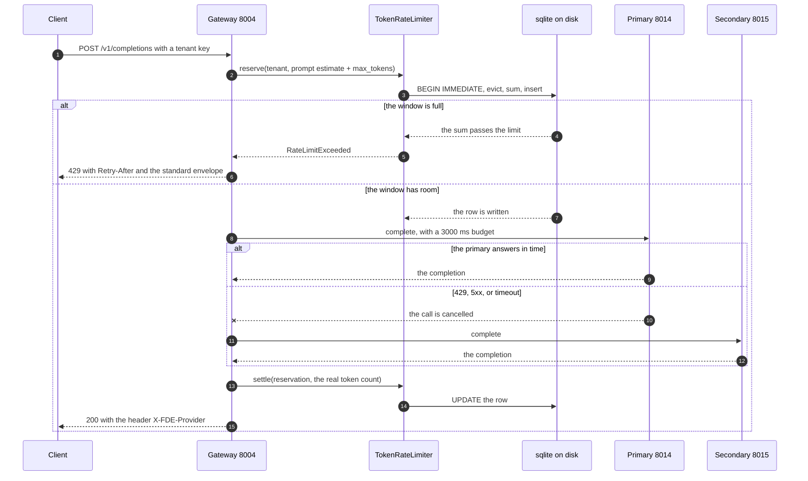

# FDE Assessment — MCP & LLM Gateways

Four runnable services in one Python package. Each one is a separate task from
the assessment, and each one runs on its own.

| Task | Service | Problem it solves |
| --- | --- | --- |
| 1 | [MCP server](src/fde/task1_mcp_server/) | Strict tool validation, and a stdout that stays pure JSON-RPC |
| 2 | [MCP gateway](src/fde/task2_mcp_gateway/) | An agent must not call an admin tool with a viewer token |
| 3 | [Stream guardrail](src/fde/task3_stream_guardrail/) | Redact PII in a live token stream without buffering the answer |
| 4 | [Model router](src/fde/task4_router/) | A tenant token budget, and failover when a provider fails |

MCP means Model Context Protocol. PII means personally identifiable
information. Every external server is mocked, so no task needs an API key or a
network.

---

## Quick start

```bash
make install     # uv sync
make check       # ruff + 93 tests
make demo        # all 4 demonstrations, about 30 seconds
```

Run one demonstration:

```bash
bash scripts/demo_task1.sh    # validation errors, and a clean stdout
bash scripts/demo_task2.sh    # an admin tool denied to a viewer
bash scripts/demo_task3.sh    # PII redacted across chunk boundaries
bash scripts/demo_task4.sh    # failover on 429, on timeout, and the token budget
```

---

## How the 4 services fit together

Task 2 guards the tool path. Task 3 and task 4 guard the model path. Task 1 is
the tool server that sits behind task 2.



Repository layout:

```
src/fde/
  core/                    logging to stderr, JSON-RPC models, error envelope
  task1_mcp_server/        the MCP server and its stdout guard
  task2_mcp_gateway/       the proxy, the auth, the policy, the mock downstream
  task3_stream_guardrail/  the redactor, the SSE codec, the proxy, the mock provider
  task4_router/            the limiter, the sqlite layer, the router, the providers
tests/                     one folder for each task, plus the shared core
scripts/                   one demonstration for each task
design/                    the plan, the requirement trace, the decision records
```

---

## Task 1 — MCP server with strict validation

Two tools. `get_customer_record` takes a `customer_id` in the format
`CUST-XXXXX`. `trigger_refund` takes a `customer_id`, a positive `amount`, and
a `reason` of at least 10 characters.

### The flow


### The 2 decisions that matter

**A validation failure must be a protocol error, not a tool result.** The SDK
decorator `@server.call_tool()` wraps the handler in `except Exception` and
returns a result with `isError=true`. A raised `McpError` never reaches the
wire through it. So [server.py](src/fde/task1_mcp_server/server.py) registers
the handler directly:

```python
server.request_handlers[types.CallToolRequest] = _handle_call_tool
```

The dispatcher then turns a raised `McpError` into a real JSON-RPC error.

| Case | Code |
| --- | --- |
| Bad format, wrong type, or an extra field | -32602 |
| Unknown tool | -32601 |
| A failure inside the tool body | -32603 |

**A stray print must not corrupt the stream.**
[stdout_guard.py](src/fde/task1_mcp_server/stdout_guard.py) runs before any
other import. It hands the real stdout to the transport, then replaces
`sys.stdout`. A `print()` anywhere, in your code or in a dependency, lands on
stderr with the prefix `[stdout-leak]`.

The advertised `inputSchema` comes from `model_json_schema()`, so the schema
the client reads and the schema the server enforces can never differ.

### Run it

```bash
uv run python -m fde.task1_mcp_server     # stdio, no port
bash scripts/demo_task1.sh
```

---

## Task 2 — MCP security gateway

The gateway authenticates the HTTP request once. It authorizes each JSON-RPC
member separately. It forwards only the members it approved.

### The flow



### The 2 decisions that matter

**Deny before you connect.** The policy runs on the parsed body, inside the
gateway process. The mock server counts its requests at `/stats`, and a test
asserts that the counter does not move on a denied call. That is the proof of
requirement T2-R7.

**A batch is screened member by member.** The gateway splits the batch into an
approved list and a rejected list, forwards the approved list as one downstream
request, then merges the answers back in the original order. A notification,
which has no `id`, gets no response, as JSON-RPC 2.0 requires.

The denial returns HTTP 200, because a JSON-RPC error is a valid JSON-RPC
response. The error body carries the reason:

```json
{"jsonrpc": "2.0", "id": 1,
 "error": {"code": -32001, "message": "Unauthorized Tool Call",
           "data": {"tool": "admin_reset_key", "required_role": "admin"}}}
```

### Run it

```bash
uv run python -m fde.task2_mcp_gateway --downstream   # port 8012
uv run python -m fde.task2_mcp_gateway                # port 8002
bash scripts/demo_task2.sh
```

Demo tokens: `admin-token` and `viewer-token`.

---

## Task 3 — Streaming PII guardrail

The hard part is not the regular expression. The hard part is that a pattern
can split across 2 chunks. The provider sends `ada@exam` and then `ple.com`.
A redactor that works on one chunk alone misses the email. A redactor that
waits for the end of the stream destroys the time to first token.

### The flow



### How the hold-back works



**Why the buffer is bounded.** A cut always happens. The held tail never passes
`2 * MAX_HOLD`, that is 306 characters, whatever the response length. Memory
does not grow with the answer. That is requirement T3-R6.

**Why the time to first token stays low.** Normal prose holds spaces often, so
the redactor emits almost every word at once and holds one partial word. Measured
on the demonstration:

| Measure | Value |
| --- | --- |
| Provider pace | 26 chunks, 25 ms each |
| Time to first token | about 110 ms, near 2 provider chunks |
| Total stream time | about 720 ms |

**Why the held tail stays raw.** An early version redacted the buffer in place.
A complete but still growing match, such as `a@b.co` before the `m` arrives,
became `[REDACTED]m`. The redactor now redacts only the text that it emits.

Patterns: email, United States social security number, and credit card. A card
candidate must also pass the Luhn check, which cuts false positives on long
digit runs. Every pattern is bounded and nests no quantifier, so the engine
cannot backtrack out of control.

### Run it

```bash
uv run python -m fde.task3_stream_guardrail --provider   # port 8013
uv run python -m fde.task3_stream_guardrail              # port 8003
bash scripts/demo_task3.sh
```

---

## Task 4 — Rate limiter and model fallback

Two independent concerns in one request path: a token budget for each tenant,
and a provider that may be slow or full.

### The flow



### The 3 decisions that matter

**The check and the insert are one transaction.** A separate check and insert
lets 2 parallel requests both pass a full window.
[limiter.py](src/fde/task4_router/limiter.py) runs the evict, the sum, and the
insert inside one `BEGIN IMMEDIATE` transaction, which takes the write lock at
the start. A test fires 50 parallel reservations and asserts that exactly 10
pass a 1000 token window.

**Counting runs in 2 phases.** The gateway reserves the worst case, the prompt
estimate plus `max_tokens`. After the provider answers, it settles the row with
the real usage. This stops an overshoot inside the window and keeps the total
accurate even though the estimate is rough. A failed request releases its row,
so a failure never consumes the budget.

**The client learns nothing about the upstream.** Every failure passes through
one envelope in [core/errors.py](src/fde/core/errors.py):

```json
{"error": {"type": "upstream_unavailable",
           "message": "No model provider answered the request.",
           "request_id": "9c23d505819e4a71af5884de3e4ea5aa", "status": 503}}
```

The cause, the upstream message, and the traceback go to stderr with the same
`request_id`. A test plants a secret string in an upstream failure and asserts
that it never reaches the response body.

`asyncio.wait_for` cancels the primary on a timeout, so no dead connection
stays open while the secondary runs.

### Demonstration output

```
  healthy primary            -> 200 provider=primary
  primary returns 429        -> 200 provider=secondary
  primary stalls 5000 ms     -> 200 provider=secondary
  both providers fail        -> 503 upstream_unavailable
  burst of 10 parallel requests, 8192 tokens each, against a 50000 token window:
       7 200
       3 429
```

### Run it

```bash
uv run python -m fde.task4_router --primary     # port 8014
uv run python -m fde.task4_router --secondary   # port 8015
uv run python -m fde.task4_router               # port 8004
bash scripts/demo_task4.sh
```

Demo tenant keys: `tenant-a-key` and `tenant-b-key`. The database file is
`var/router.sqlite3`, in WAL mode.

---

## Shared rules

All 4 services follow the same 4 rules.

- Logs go to stderr only. Task 1 depends on it, and the rest keep it for consistency.
- One `httpx.AsyncClient` for each application, opened in the FastAPI lifespan.
- One error envelope for every client-facing failure.
- No test needs a network, a port outside the loopback address, or an API key.

## Tests

```bash
uv run pytest -q                 # 93 tests
uv run pytest tests/task3 -q     # one task
```

| Level | What it covers |
| --- | --- |
| Unit | The redactor, the limiter, the policy, the patterns, the error envelope |
| In-process integration | Each FastAPI application through `httpx.ASGITransport` |
| Subprocess integration | Task 1, because the stdout test needs a real process boundary |
| Live socket | The time to first token, because the in-process transport buffers |
| Property | Task 3, splitting the same text at every offset |
| Concurrency | 50 parallel reservations against one sqlite file |

Every test names the requirement it covers:

```python
@pytest.mark.req("T3-R4")
def test_a_pattern_split_across_many_chunks_is_redacted(): ...
```

`tests/core/test_requirement_coverage.py` fails if a requirement listed in
[design/01-requirements.md](design/01-requirements.md) has no test.

## Known limits

- The token stores in task 2 and task 4 are static maps. A real deployment
  reads an identity provider or a tenant directory. `resolve_role` and
  `_resolve_tenant` are each one function, so a real backend replaces one call.
- `estimate_tokens` divides the character count by 4. A real deployment uses
  the provider tokenizer. The settle step corrects the window total either way.
- The Luhn check reduces false positives on card numbers but does not remove them.
- The sqlite limiter covers one host. A multi-host deployment needs Redis or a
  shared database. The limiter interface does not change.
- The mock providers replace real model endpoints. They speak plain HTTP JSON,
  so a real adapter replaces `Provider.complete` alone.
- A 5xx failover in task 4 is an addition, not a stated requirement.
- Task 5 is out of scope. The assessment overview names it, but the document
  gives no problem statement. See [design/tasks/task-5-zero-trust.md](design/tasks/task-5-zero-trust.md).

## Design documents

| File | Purpose |
| --- | --- |
| [design/01-requirements.md](design/01-requirements.md) | Every requirement, with a trace identifier |
| [design/02-plan-2-day.md](design/02-plan-2-day.md) | The schedule and the definition of done |
| [design/03-architecture.md](design/03-architecture.md) | Repository layout and data flow |
| [design/04-decisions.md](design/04-decisions.md) | 17 decision records, with the refinements found during the build |
| [design/05-testing-and-demo.md](design/05-testing-and-demo.md) | Test strategy and review path |
