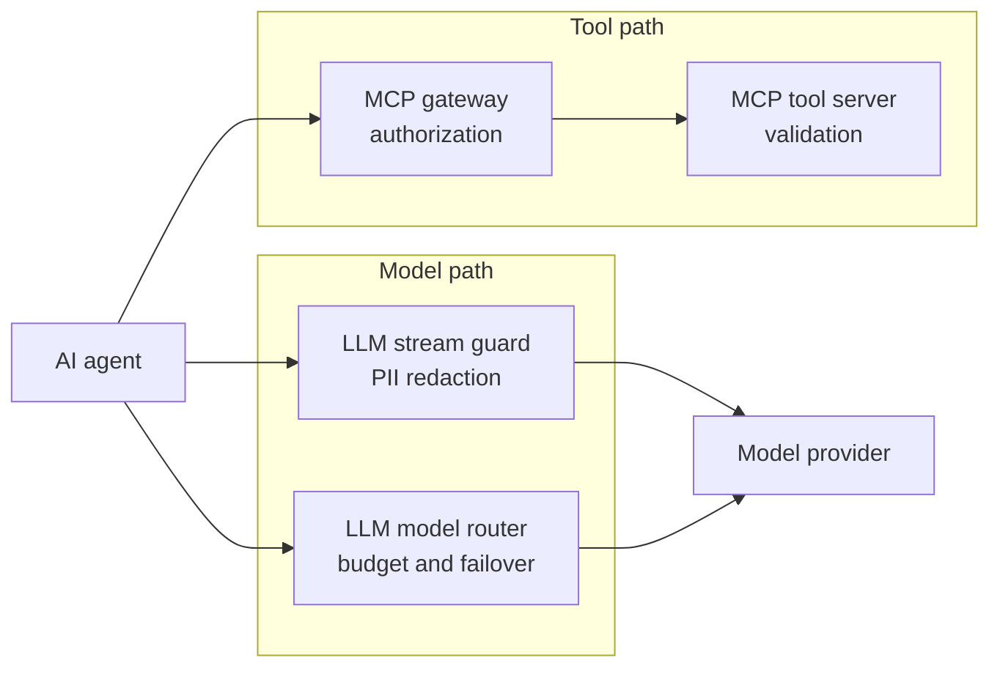
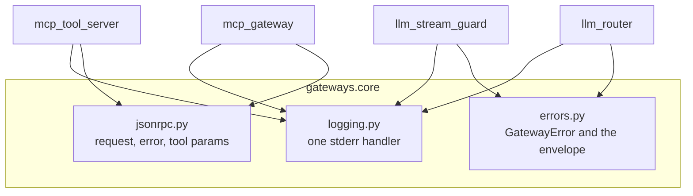
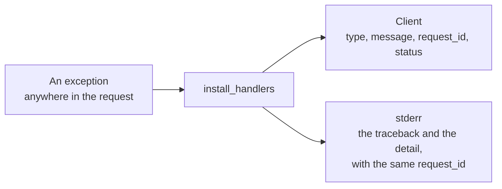

# Architecture

## The idea

An AI agent reaches 2 kinds of external system: a tool server, and a model
provider. Both paths need a control point that the agent cannot skip. This
repository holds 4 services that provide those control points.



Each service answers one question.

| Service | Question | Answer |
| --- | --- | --- |
| MCP tool server | Is this tool input safe to act on? | Pydantic, then a JSON-RPC error code |
| MCP gateway | Is this caller allowed to run this tool? | A role from the token, then a policy |
| LLM stream guard | Does this answer leak PII? | A bounded hold-back buffer over the stream |
| LLM model router | Can this tenant afford this call, and who serves it? | SQLite window, then a failover race |

## Repository layout

```
src/gateways/
  core/                logging to stderr, JSON-RPC models, the error envelope
  mcp_tool_server/     the MCP server and its stdout guard
  mcp_gateway/         the proxy, the auth, the policy, the mock downstream
  llm_stream_guard/    the redactor, the SSE codec, the proxy, the mock provider
  llm_router/          the limiter, the sqlite layer, the router, the providers
tests/                 one folder for each service, plus the shared core
scripts/               one demonstration for each service
design/                this folder
```

## Why one repository

The 4 services repeat 3 concerns: a logger that never touches stdout, a
JSON-RPC model, and a safe error envelope. A copy of each concern in 4 places
hides the real work. One install and one test command also make review fast.

Each service still runs alone. Each one has its own `__main__.py`, its own
settings class, and its own mock upstream.

## The shared core



### `logging.py`

One function, `get_logger(name)`. The handler writes to `sys.stderr` only. The
MCP tool server depends on this rule, because its stdout carries the protocol.
The other services keep the same rule, so a container log reads the same way
for all 4.

### `jsonrpc.py`

Pydantic models for a JSON-RPC 2.0 request, a response, and an error, plus the
standard error codes. The MCP tool server and the MCP gateway both use them.

### `errors.py`

One exception class, `GatewayError`, with a `type`, a `status`, a client
`message`, and an internal `detail`. One function, `to_client_payload`, builds
the envelope. The `detail` never reaches the client.



The `request_id` is the only handle that crosses the boundary. Support reads
the log by that identifier.

## Cross-cutting rules

- Every module writes logs to stderr.
- Every HTTP client is one `httpx.AsyncClient`, opened in the FastAPI lifespan.
- Every HTTP service is a FastAPI application, run with `uvicorn`.
- Every external system is mocked. No test needs a network or an API key.
- Every public function carries type hints. `ruff` enforces the style.

## Ports

| Port | Process |
| --- | --- |
| none | MCP tool server, which speaks over stdio |
| 8002 | MCP gateway |
| 8012 | Mock downstream MCP server |
| 8003 | LLM stream guard |
| 8013 | Mock streaming provider |
| 8004 | LLM model router |
| 8014 | Mock primary model provider |
| 8015 | Mock secondary model provider |
